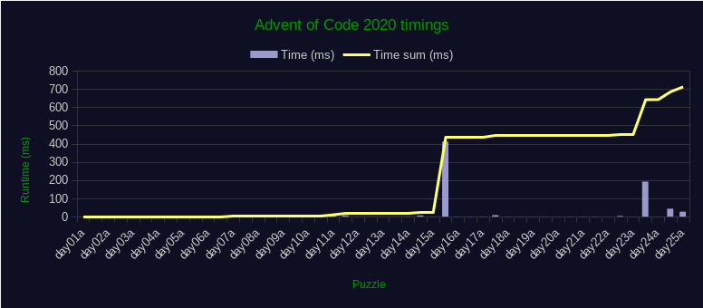

# Advent of Code 2020 in Rust
My [Advent of Code 2020][aoc-2020] solutions in the Rust programming language.
This repository holds a separate Rust project for each day and part.

This year I attempt to develop a standalone, short, compact and fast solution
for each problem (day part).

## Timings
Here is how long each solution takes to run to completion.
All solutions are measured (non scientifically) with [`hyperfine`][hyperfine] on
a `i5-4670k @ 3.8Ghz` machine running Linux.
Timings include binary loading, execution, input and output timings.



|                                                | part A                              | part B                              |
|:-----------------------------------------------|:------------------------------------|:------------------------------------|
| [day 1](https://adventofcode.com/2020/day/1)   | [`  0.170ms`](./day01a/src/main.rs) | [`  0.007ms`](./day01b/src/main.rs) |
| [day 2](https://adventofcode.com/2020/day/2)   | [`  0.553ms`](./day02a/src/main.rs) | [`  0.069ms`](./day02b/src/main.rs) |
| [day 3](https://adventofcode.com/2020/day/3)   | [`  0.009ms`](./day03a/src/main.rs) | [`  0.013ms`](./day03b/src/main.rs) |
| [day 4](https://adventofcode.com/2020/day/4)   | [`  0.157ms`](./day04a/src/main.rs) | [`  0.185ms`](./day04b/src/main.rs) |
| [day 5](https://adventofcode.com/2020/day/5)   | [`  0.004ms`](./day05a/src/main.rs) | [`  0.011ms`](./day05b/src/main.rs) |
| [day 6](https://adventofcode.com/2020/day/6)   | [`  0.031ms`](./day06a/src/main.rs) | [`  0.056ms`](./day06b/src/main.rs) |
| [day 7](https://adventofcode.com/2020/day/7)   | [`  0.002ms`](./day07a/src/main.rs) | [`  1.71 ms`](./day07b/src/main.rs) |
| [day 8](https://adventofcode.com/2020/day/8)   | [`  0.022ms`](./day08a/src/main.rs) | [`  0.131ms`](./day08b/src/main.rs) |
| [day 9](https://adventofcode.com/2020/day/9)   | [`  0.043ms`](./day09a/src/main.rs) | [`  0.025ms`](./day09b/src/main.rs) |
| [day 10](https://adventofcode.com/2020/day/10) | [`  0.004ms`](./day10a/src/main.rs) | [`  0.005ms`](./day10b/src/main.rs) |
| [day 11](https://adventofcode.com/2020/day/11) | [`  0.007ms`](./day11a/src/main.rs) | [`  6.56 ms`](./day11b/src/main.rs) |
| [day 12](https://adventofcode.com/2020/day/12) | [`  0.011ms`](./day12a/src/main.rs) | [`  0.011ms`](./day12b/src/main.rs) |
| [day 13](https://adventofcode.com/2020/day/13) | [`  0.002ms`](./day13a/src/main.rs) | [`  0.004ms`](./day13b/src/main.rs) |
| [day 14](https://adventofcode.com/2020/day/14) | [`  0.276ms`](./day14a/src/main.rs) | [`  6.10 ms`](./day14b/src/main.rs) |
| [day 15](https://adventofcode.com/2020/day/15) | [`  0.227ms`](./day15a/src/main.rs) | [`526    ms`](./day15b/src/main.rs) |
| [day 16](https://adventofcode.com/2020/day/16) | [`  0.209ms`](./day16a/src/main.rs) | [`  0.526ms`](./day16b/src/main.rs) |
| [day 17](https://adventofcode.com/2020/day/17) | [`  0.357ms`](./day17a/src/main.rs) | [`  7.98 ms`](./day17b/src/main.rs) |
| [day 18](https://adventofcode.com/2020/day/18) | [`  0.246ms`](./day18a/src/main.rs) | [`  0.228ms`](./day18b/src/main.rs) |
| [day 19](https://adventofcode.com/2020/day/19) | [`  0.364ms`](./day19a/src/main.rs) | [`  0.523ms`](./day19b/src/main.rs) |
| [day 20](https://adventofcode.com/2020/day/20) | [`  0.111ms`](./day20a/src/main.rs) | [`  0.460ms`](./day20b/src/main.rs) |
| [day 21](https://adventofcode.com/2020/day/21) | [`  0.464ms`](./day21a/src/main.rs) | [`  0.293ms`](./day21b/src/main.rs) |
| [day 22](https://adventofcode.com/2020/day/22) | [`  0.003ms`](./day22a/src/main.rs) | [`  3.42 ms`](./day22b/src/main.rs) |
| [day 23](https://adventofcode.com/2020/day/23) | [`  0.005ms`](./day23a/src/main.rs) | [`192    ms`](./day23b/src/main.rs) |
| [day 24](https://adventofcode.com/2020/day/24) | [`  0.105ms`](./day24a/src/main.rs) | [` 43.2  ms`](./day24b/src/main.rs) |
| [day 25](https://adventofcode.com/2020/day/25) | [` 27.9  ms`](./day25a/src/main.rs) |                                     |

|              | one-by-one                             | parallel                                   |
|:-------------|:---------------------------------------|:-------------------------------------------|
| _everything_ | [`714ms`](./runner/src/bin/runner.rs)  | [`511ms`](./runner/src/bin/runner-par.rs)  |

## Run solutions
Each Rust project contains a `input.txt` file, holding the puzzle input. Simply
run the project to see the solution appear.

```bash
# One solution requires large stack size, set to allow unlimited size
ulimit -s unlimited

# Switch to day 1a, and run it
cd day01a
cargo run --release

# Or run everything in parallel
cd ../runner
cargo run --release --bin runner-par

# Or benchmark every day
cd ../runner
cargo run --release --bin bench
```

Some solutions might require Rust Nightly.

## Previous years
- [2019](https://github.com/timvisee/advent-of-code-2019)
- [2018](https://github.com/timvisee/advent-of-code-2018)
- [2017](https://github.com/timvisee/advent-of-code-2017)

## License
This project is released under the GNU GPL-3.0 license.
Check out the [LICENSE](LICENSE) file for more information.

[aoc-2020]: https://adventofcode.com/2020
[hyperfine]: https://github.com/sharkdp/hyperfine
